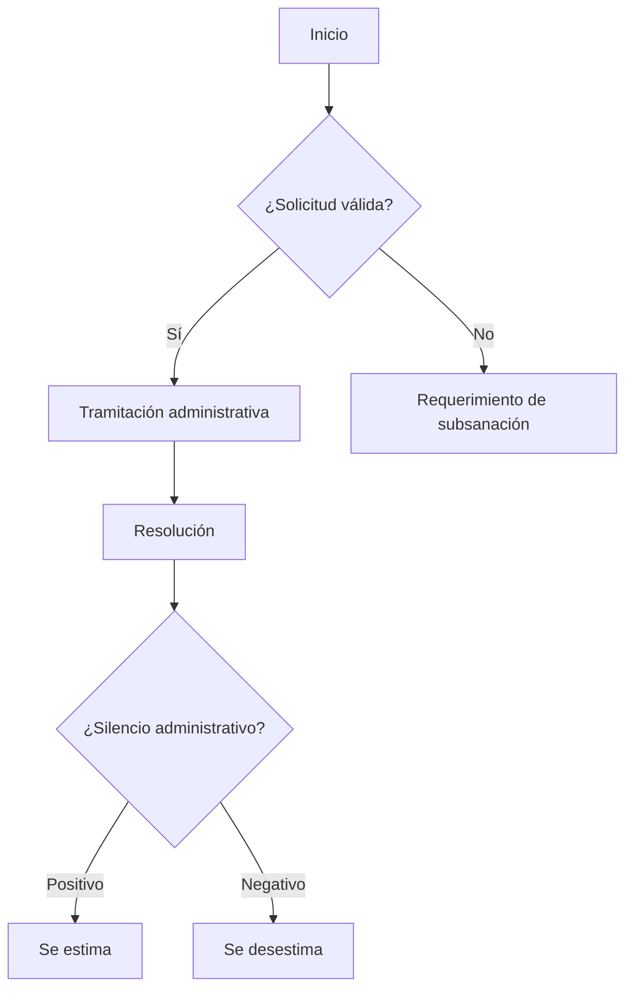

**Código de clasificación:** C001
**Familia:** TRANSPARENCIA

---

### OBJETO / DESCRIPCIÓN

Permite a cualquier persona solicitar información pública que esté en poder del Ayuntamiento, como contratos, subvenciones, datos estadísticos o cualquier otra documentación relevante, con el fin de garantizar la transparencia institucional.

### FORMA DE PRESENTACIÓN

Electrónica

### PLAZO DE PRESENTACIÓN

Continuo

### FORMA DE INICIACIÓN

Solicitud del interesado

### REQUISITOS Y DOCUMENTACIÓN

- Solicitud: impreso normalizado.
- DNI/CIF.

### ÓRGANO DE RESOLUCIÓN

Alcaldía

### EFECTO DEL SILENCIO

Desestimatorio

### NORMATIVA APLICABLE

- Reglamento (UE) 2016/679 del Parlamento Europeo y del Consejo, de 27 de abril de 2016, relativo a la protección de las personas físicas en lo que respecta al tratamiento de datos personales y a la libre circulación de estos datos y por el que se deroga la Directiva 95/46/CE (Reglamento general de protección de datos) (Norma Completa)
- Constitución Española de 1978 (Art. 105.b)
- Ley Orgánica 3/2018, de 5 de diciembre, de Protección de Datos Personales y garantía de los derechos digitales. (Norma Completa)
- Ley 12/2014, de 26 de diciembre, de transparencia y de acceso a la información pública. (Tit. III)
- Ley 7/2015, de 1 de abril, de los municipios de Canarias. (Arts. 22-24)
-Ley 19/2013, de 9 de diciembre, de transparencia, acceso a la información pública y buen gobierno. (Arts. 12-24)
-Ley 39/2015, de 1 de octubre, del Procedimiento Administrativo Comun de las Administraciones Publicas. (Art. 13.d)
- Ley 39/2015, de 1 de octubre, del Procedimiento Administrativo Común. (Arts. 9 y 66)
- Ley 7/1985, de 2 de abril, reguladora de las Bases del Régimen Local. (Art. 21.1.a, Art. 70)
- Reglamento de desarrollo de la Ley Orgánica 15/1999, de 13 de diciembre, de protección de datos de carácter personal aprobdo por el Real Decreto 1720/2007, de 21 de diciembre. (Arts. 23, 24 y 25)

### RECURSOS

Alzada

### DIAGRAMA

[← Volver al catálogo de procedimientos](../buscador.md)