**Código de clasificación:** C016
**Familia:** RESPONSABILIDAD PATRIMONIAL

---

### OBJETO / DESCRIPCIÓN

Permite a cualquier persona reclamar una indemnización al Ayuntamiento si ha sufrido daños o perjuicios derivados del funcionamiento normal o anormal de los servicios públicos municipales, siempre que se acrediten los requisitos legales para ello.

### FORMA DE PRESENTACIÓN

Electrónica

### PLAZO DE PRESENTACIÓN

Continuo

### FORMA DE INICIACIÓN

Solicitud del interesado

### REQUISITOS Y DOCUMENTACIÓN

- Formulario de solicitud

### ÓRGANO DE RESOLUCIÓN

(sin datos)

### EFECTO DEL SILENCIO

Desestimatorio

### NORMATIVA APLICABLE

- Ley Orgánica 3/1980, de 22 de abril, del Consejo de Estado. (Norma completa)
- Ley 7/2015, de 1 de abril, de los municipios de Canarias. (Art. 107)
- Ley 39/2015, de 1 de octubre, del Procedimiento Administrativo Comun de las Administraciones Publicas. (Art. 13, Art. 3, Art. 61, Art. 67, Art. 86, Art. 91, Art. 96, Arts. 64-65, Arts. 81-82)
- Ley 39/2015, de 1 de octubre, del Procedimiento Administrativo Común. (Arts. 9 y 66)
- Ley 40/2015, de 1 de octubre, de Régimen Jurídico del Sector Público. (Arts. 32-37)
- Ley 5/2002, de 3 de junio, del Consejo Consultivo de Canarias. (Art. 11.D.e, Art. 12.3, Art. 20)
- Ley 7/1985, de 2 de abril, reguladora de las Bases del Régimen Local. (Art. 21.1.k, Art. 22.2.j)

### RECURSOS

(sin datos)

### DIAGRAMA

```mermaid
flowchart TD

%% INICIO Y ORDENACIÓN
start([Forma de iniciación])
start --> tipo{¿A solicitud o de oficio?}
tipo -->|A solicitud| A01[Recepción solicitud]
tipo -->|De oficio| A11[Acuerdo de incoación de expediente]
A01 --> A11[Acuerdo de incoación de expediente]
A11 --> A03[Dar de alta expediente]
A03 --> A04[Incorporar datos de registro]
A04 --> A05{¿Existen actuaciones previas?}
A05 -->|Sí| A06[Incorporar actuaciones previas al expediente]
A05 -->|No| A07[Revisar solicitud y documentación complementaria]
A06 --> A07

A07 --> A08{¿Completa y conforme?}
A08 -->|No| A09[Subsanación]
A09 --> A10{¿Recibida en plazo y correcta?}
A10 -->|No| A11b[Archivo]
A11b --> A12[Notificación]
A10 -->|Sí| A13[Incorporar documentación al expediente]

A08 -->|Sí| A13
A13 --> A14{¿Procede incorporar actuaciones previas?}
A14 -->|Sí| A15[Incorporar documentación de actuaciones previas]
A14 -->|No| A16[Dar de alta expediente]
A15 --> A16

%% INSTRUCCIÓN
A16 --> B01[Solicitud informes internos]
B01 --> B02[Trámite de audiencia]
B02 --> B03{¿Se solicita práctica de pruebas?}
B03 -->|Sí| B04[Resolución motivada de rechazo]
B04 --> B05[Notificación]
B05 --> B06[Propuesta de resolución]
B03 -->|No| B06

B06 --> B07{¿Indemnización ≥ 50.000€?}
B07 -->|Sí| B08[Solicitud dictamen Consejo de Estado]
B08 --> B09[Recepción informe Consejo de Estado]
B09 --> B10[Notificación propuesta resolución]
B07 -->|No| B10

B10 --> B11{¿Se estiman pretensiones del reclamante?}
B11 -->|Sí| B12[Solicitud aportación certificada nº cuenta]
B12 --> B13[Incorporar fiscalización de la IGAE]
B13 --> B14[Redacción propuesta resolución definitiva]
B14 --> C01[Resolución]

B11 -->|No| C01

%% TERMINACIÓN
C01 --> C02{¿Se solicitó dictamen al Consejo de Estado?}
C02 -->|Sí| C03[Comunicar resolución al Consejo de Estado]
C03 --> C04[Notificación al interesado]
C02 -->|No| C04
C04 --> C05[Archivo]
```

[← Volver al catálogo de procedimientos](../buscador.md)