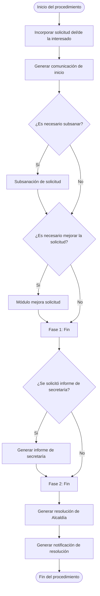

**Código de clasificación:** C086

**Familia:** SERVICIOS BÁSICOS

---

### OBJETO / DESCRIPCIÓN

Permite a los residentes en zonas de estacionamiento regulado solicitar una tarjeta que les permita aparcar sin limitación de tiempo en dichas zonas, con el fin de facilitar el aparcamiento en su vecindario.

### FORMA DE PRESENTACIÓN

Electrónica

### PLAZO DE PRESENTACIÓN

Continuo

### FORMA DE INICIACIÓN

Solicitud del interesado

### REQUISITOS Y DOCUMENTACIÓN

- Formulario de solicitud

### ÓRGANO DE RESOLUCIÓN

(sin datos)

### EFECTO DEL SILENCIO

Según normativa

### NORMATIVA APLICABLE

- Ley 39/2015, de 1 de octubre, del Procedimiento Administrativo Común de las Administraciones Públicas. (Norma Completa)

### RECURSOS

(sin datos)

### DIAGRAMA

[← Volver al buscador de procedimientos](../buscador.md)